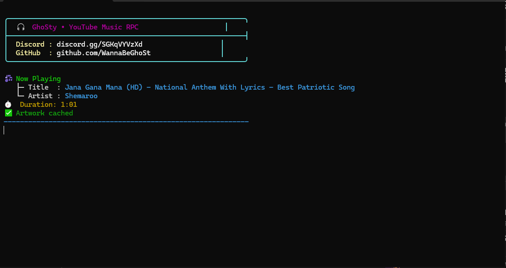
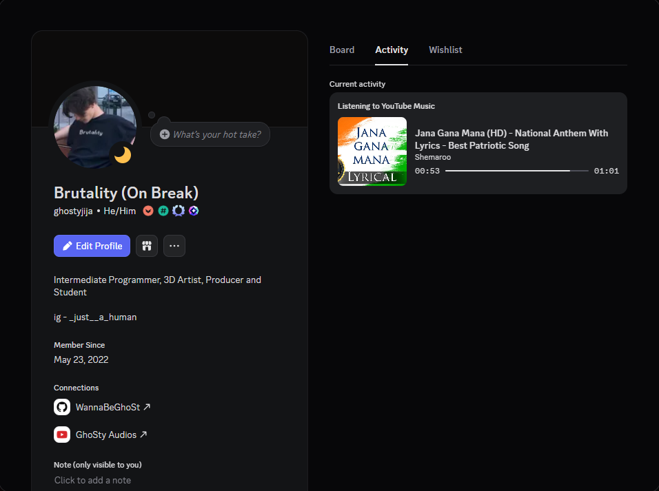

# 🎧 GhoSty YouTube Music RPC


---

## ⚠️ Disclaimer  

**This project is created strictly for educational and personal use only.**  
The author is **NOT responsible** for any misuse or violations of Discord’s Terms of Service.

---

## 📌 About  

A minimal and lightweight **Python-based Discord Rich Presence (RPC)** tool that displays  
**YouTube Music / system media playback** directly on your Discord profile using Windows Media Sessions.

Designed to be:
- clean
- silent
- low resource
- always-on

---

## 🖼️ Screenshots  

### 💻 CLI UI  


### 💬 Discord Rich Presence  


---

## 🚀 Features  

- 🎵 **Auto Detects Currently Playing Media**
- 🖼️ **YouTube Music Artwork Fetching**
- 💾 **Artwork Caching System**
- ⏱ **Live Playback Timestamps**
- ▶️ **Play / Pause State Sync**
- 🎧 **Listening Activity Mode**
- 🧠 **Minimal & Soothing CLI UI**
- ⚡ **Low CPU & Memory Usage**

---

## 🖥️ Requirements  

- **OS:** Windows 10 / 11  
- **Python:** 3.10 – 3.12  
- **Discord Desktop App (Running)**  

---

## 📦 Installation  

### 1️⃣ Clone the Repository  

```bash
git clone https://github.com/WannaBeGhoSt/youtubemusic-discord-rpc.git
cd youtubemusic-discord-rpc
````

### 2️⃣ Install Dependencies

```bash
pip install -r requirements.txt
```

---

## ▶️ Usage

### 1️⃣ Discord Application Setup

1. Go to: [https://discord.com/developers/applications](https://discord.com/developers/applications)
2. Create a new application
3. Enable **Rich Presence**
4. Upload assets:

   * `play` (Optional)
   * `pause` (Optional)
   * `ytmusic_logo` (Optional)
5. Copy **Application (Client) ID**
6. Paste it into the script as `CLIENT_ID` | Line 32 main.py

---

### 2️⃣ Run the Script

```bash
python main.py
```

The script will automatically:

* detect system media
* fetch artwork
* update Discord Rich Presence
* sync play / pause state

---

## 🧠 How It Works

* Uses **Windows Global System Media Transport Controls**
* Reads metadata from active media sessions
* Fetches thumbnails from YouTube
* Updates Discord Rich Presence in real time

No browser injection.
No Discord automation.
No token usage.

---

## 💬 Support Server

### 🔗 Join Async Development

[](https://discord.gg/SyMJymrV8x)

---

## 👤 Author

* **GhoSty**
* **GitHub:** [https://github.com/WannaBeGhoSt](https://github.com/WannaBeGhoSt)
* **Discord:** @ghostyjija
* **Community:** Async Development

---

## 🤝 Contributing

Contributions, improvements, and suggestions are welcome.
Open an issue or submit a pull request.

---

## ⚠️ Important Notices

* 🚫 **Re-selling or redistributing without permission is prohibited**
* ⚠️ **Use responsibly**
* ❗ Not affiliated with Discord or YouTube

---

⭐ If you find this project useful, consider starring the repository.